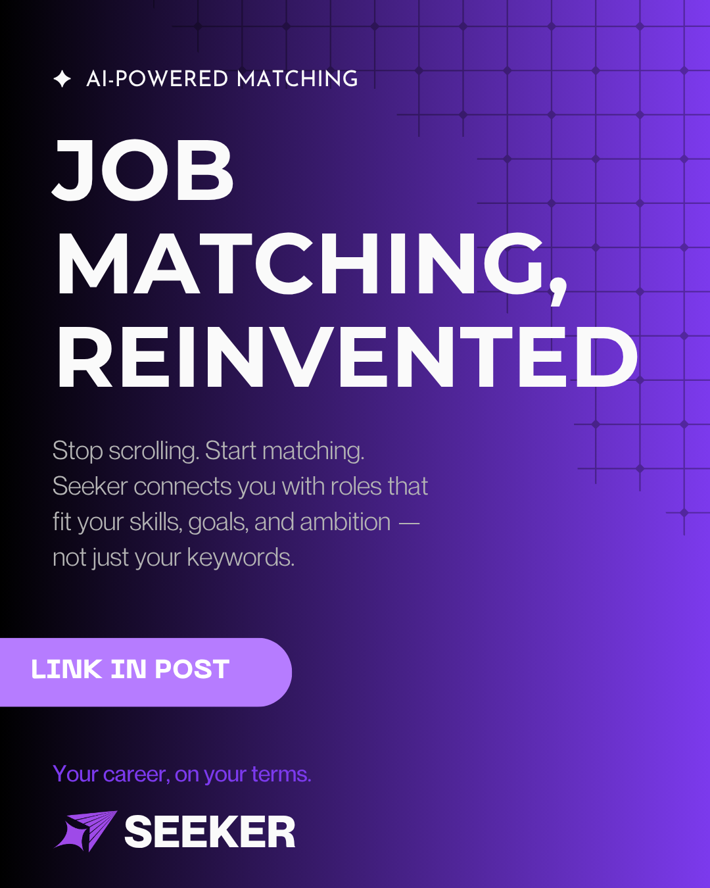
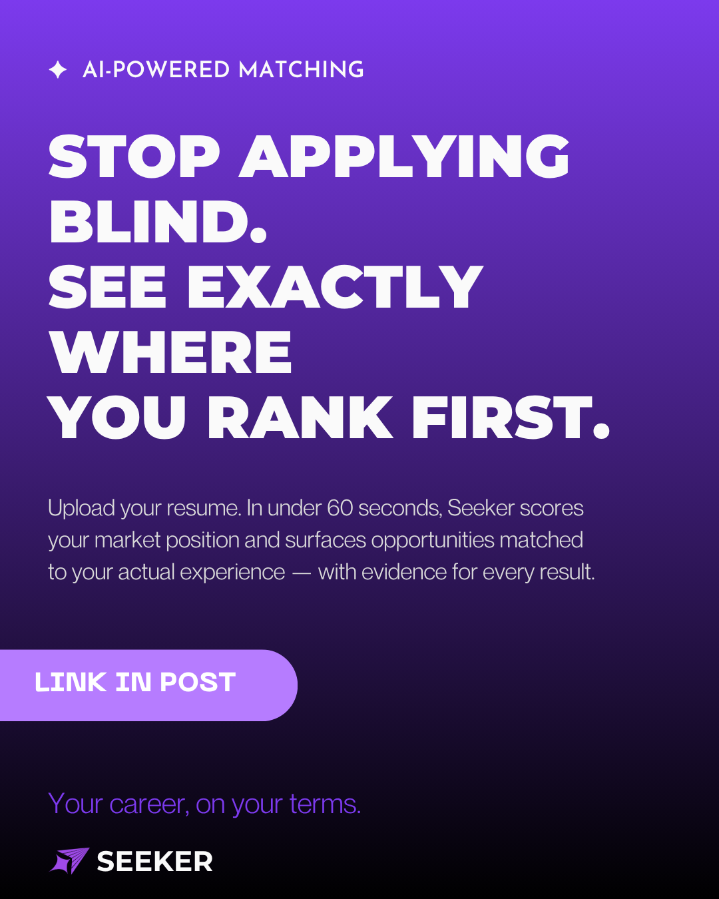
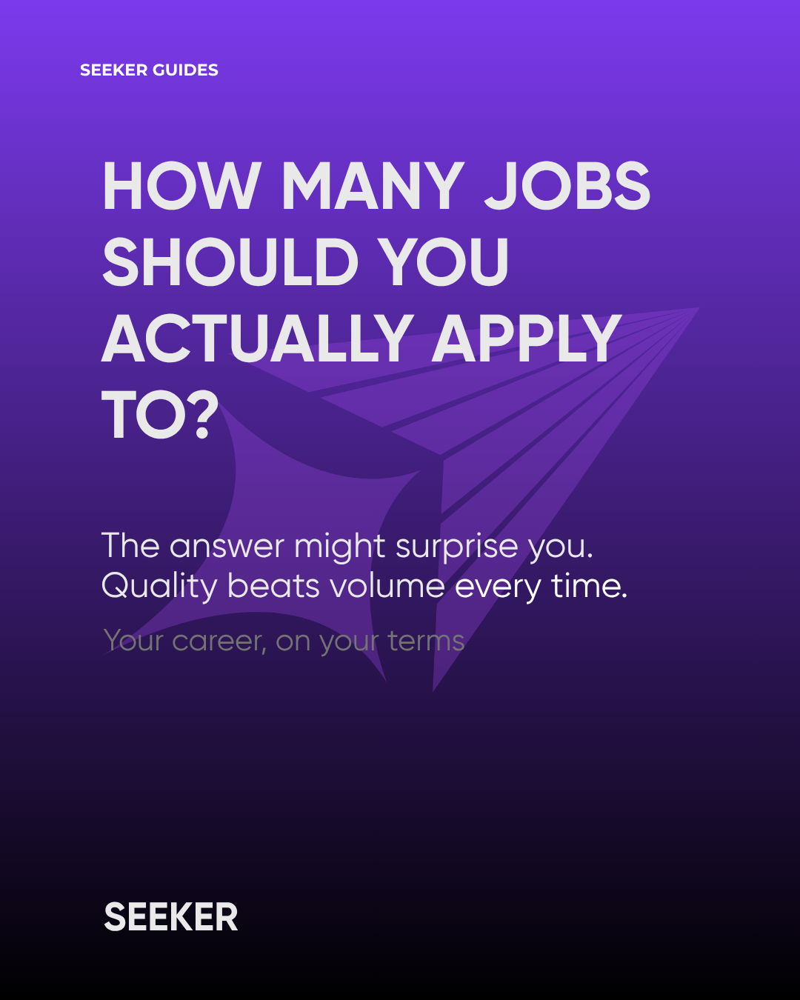

# LinkedIn Content

## Overview

Post graphics I wrote and designed for Seeker's LinkedIn presence.

## Preview

  

## Contents

| File | Description |
|---|---|
| `job-matching-reinvented.png` | "Job Matching, Reinvented." |
| `ai-powered-matching.png` | "Stop Applying Blind. See Exactly Where You Rank First." |
| `how-many-jobs-should-you-apply-to.png` | "How Many Jobs Should You Actually Apply To?" |
| `post-copy-log.md` | Confirmed post copy (hook, body, hashtags, CTA) for 7 published LinkedIn posts. |
