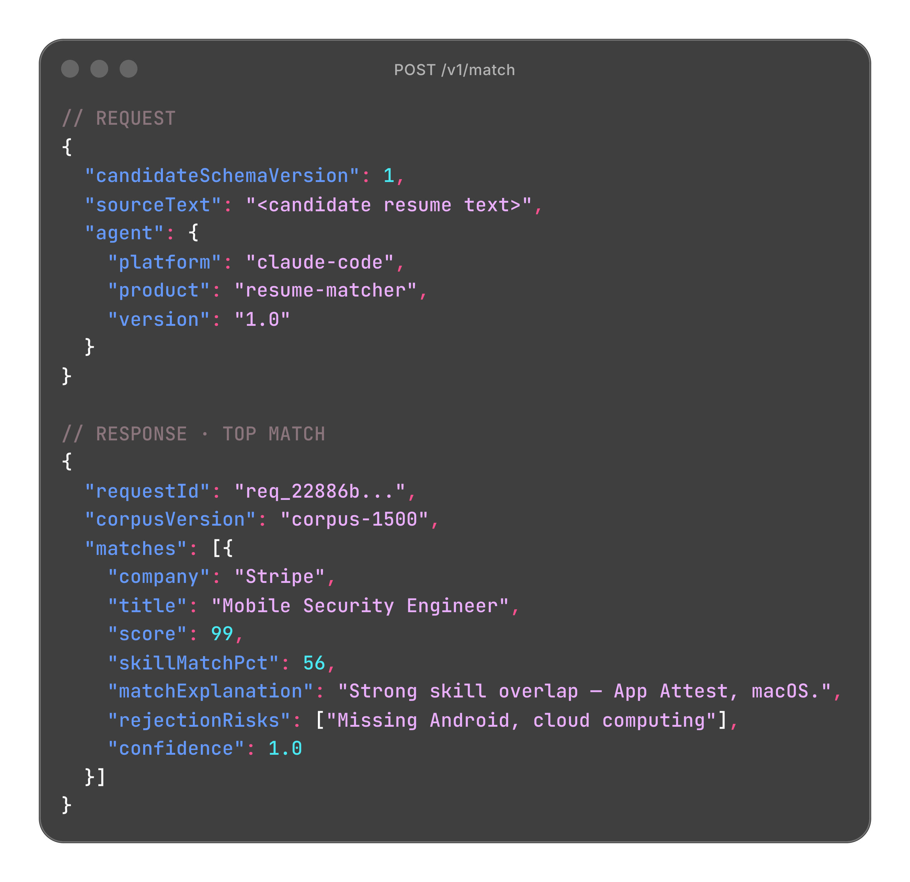

# API Mockup

## Overview

Seeker sells to two audiences at once: job seekers who need the product to feel approachable, and developers who need it to feel credible. This folder is reserved for the second audience. The mockups it will hold, dark JSON request/response cards, annotated schema breakdowns, and layout variations built in Ray.so and Canva, exist to make one point visually: Seeker isn't another LLM wrapper. It returns structured, explainable output (`matchExplanation`, `rejectionRisks`, `corpusVersion`) that a developer can actually read and build against, and the visuals are meant to prove that at a glance.

## Preview

## Contents

| File | Description |
|---|---|
| `api-mockup-post-v1-match.png` | Ray.so-style mockup of `POST /v1/match`: request payload plus a top-match response showing `score`, `skillMatchPct`, `matchExplanation`, `rejectionRisks`, `confidence`, and `corpusVersion`. |

## Status

More layout variations (annotated fields, alternate cards) were designed alongside this one but haven't been exported yet. This is the first of that set to make it into the repo.
