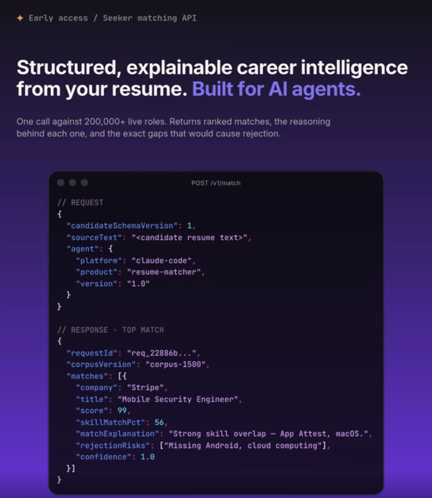
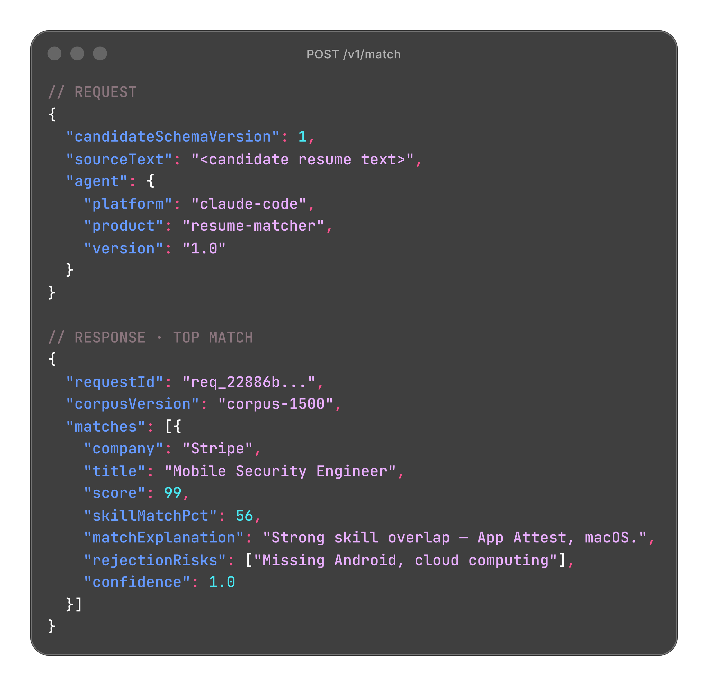

# API Mockup

## Overview

Developer-facing visuals I designed for Seeker's matching API.

## Preview

## Contents

| File | Description |
|---|---|
| `seeker-api-screenshot.png` | Screenshot of the Seeker matching API landing page — shows the POST /v1/match request/response structure, match scoring, and rejection risk output. |
| `api-mockup-post-v1-match.png` | Ray.so-style mockup of a sample API request and response. |
