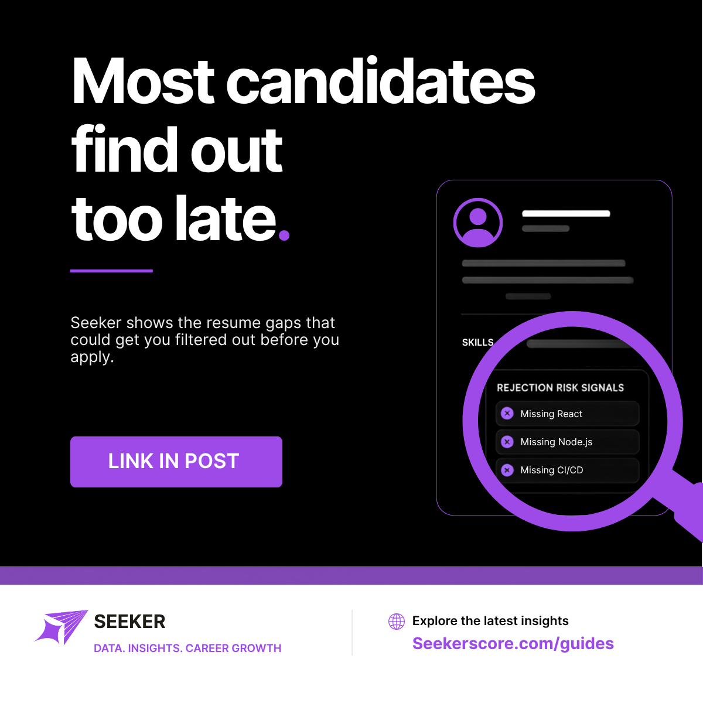

# Social Graphics

## Overview

Not everything fits neatly into a single platform's weekly content calendar. This folder holds the visuals that support the brand more broadly rather than one scheduled post: the push that announced the Seeker blog, the standalone logo mark reused wherever a clean brand asset is needed, and a beta product video ad that doesn't belong to any one platform's slot.

## Preview

 

## Contents

| File | Description |
|---|---|
| `blog-launch-announcement.png` | "Most Candidates Find Out Too Late." Rejection-risk-signals graphic used to drive traffic to the newly launched Seeker Guides blog at seekerscore.com/guides, part of the broader content pillar strategy of publishing insights only Seeker's dataset can produce. |
| `seeker-logo-icon.png` | Standalone Seeker logo mark (paper plane icon), for reuse anywhere a clean brand asset is needed without the full lockup. |
| `ai-agent-beta-ad.mp4` | Video ad promoting the AI Agent beta, built for paid or organic distribution outside the regular LinkedIn and X calendars. |
